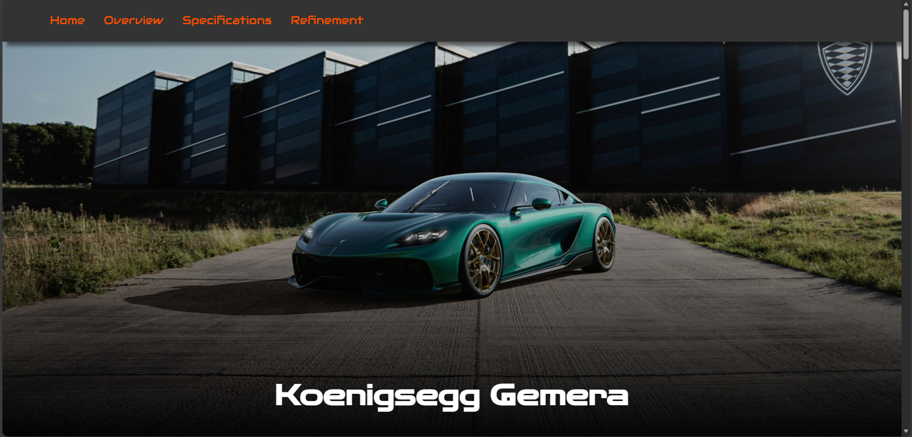
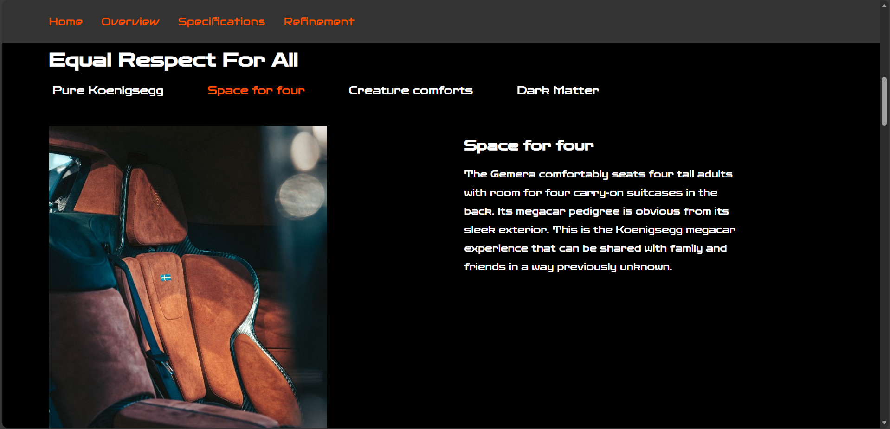
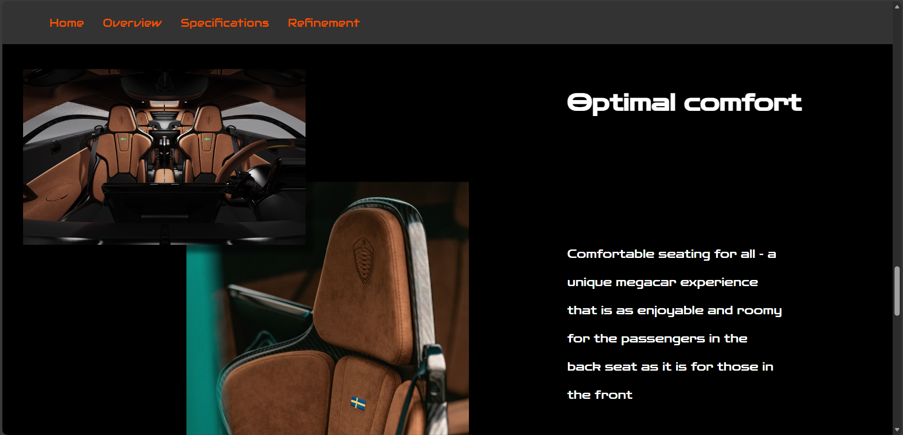
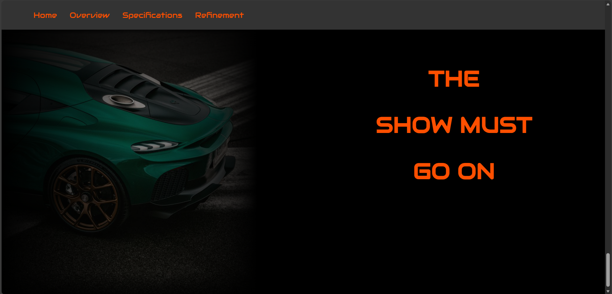

# Koenigsegg Gemera Showcase Website
A visually immersive, responsive, and interactive website built to showcase the Koenigsegg Gemera, a high-performance Mega GT. 
The project emphasizes clean design, smooth animations, elegant typography, and modular JavaScript for dynamic content switching.

  

# Features
Features
- Dynamic Feature Tabs : Switch between four highlight categories (Pure Koenigsegg, Space for Four, Creature Comforts, Dark Matter).

- Scroll-Triggered Animations

- Interactive Interior Gallery : Hovering images subtly enlarge, creating a premium visual effect.

- Smooth Navigation

  

# Technologies Used
- HTML5 for structure

- CSS3 for layout, animation, & visual design

- JavaScript (Vanilla) for interactivity & observers

- Google Fonts — Audiowide & Zen Dots

  

# Preview

---

---

---

  

# Credit
All images, specifications, and vehicle information are sourced from Koenigsegg Automotive AB.
